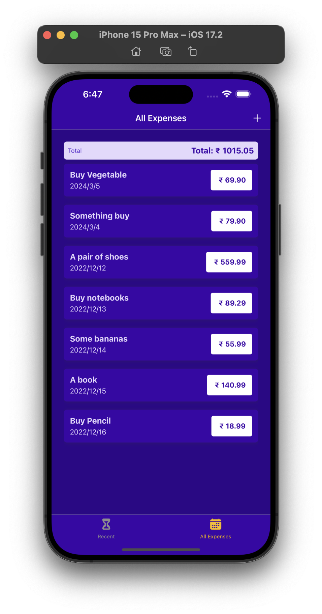
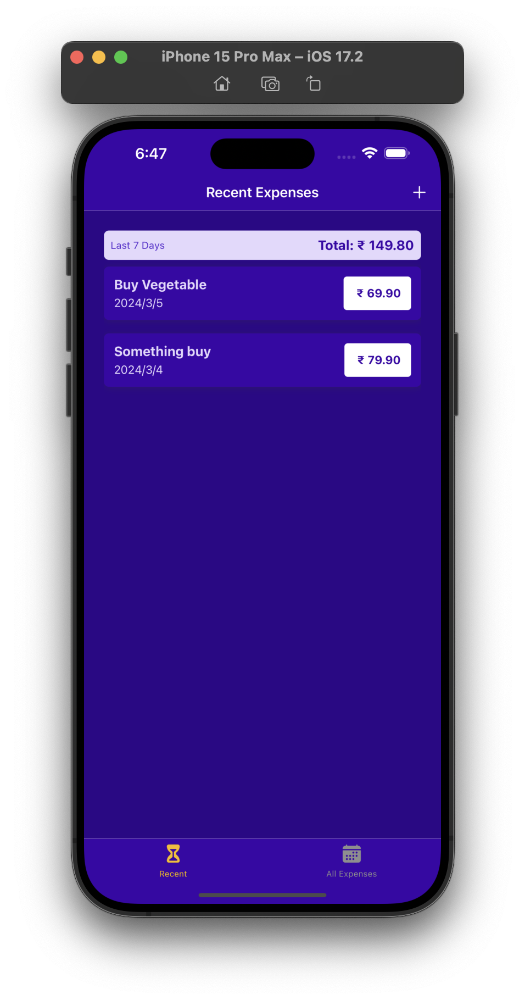
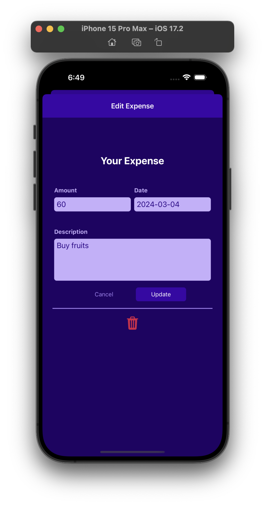
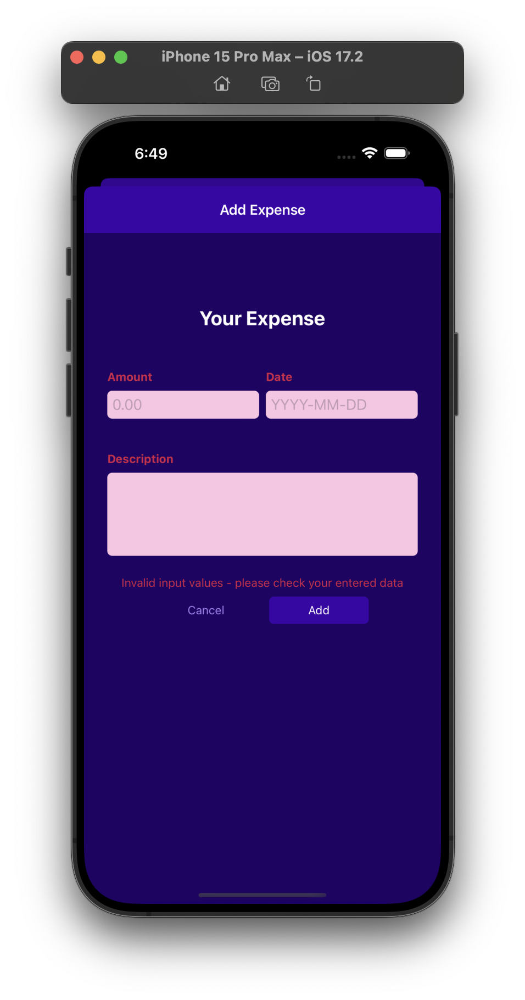

# Expense Tracker App

A simple React Native app to track your expenses. This app allows users to add, update, and delete expenses using React Context for state management.

## Features

- Add new expenses with details such as description, amount, and date.
- View a list of all expenses with the ability to update or delete each entry.

## Screenshots

Include a few screenshots or GIFs demonstrating the app's user interface and key features.






## Acknowledgements

- [ReactJS](https://react.dev)
- [React Native](https://reactnative.dev/)
- [React Context](https://react.dev)
- [Expo](https://expo.dev/)

### Prerequisites

- Node.js and npm installed on your machine.
- Expo CLI (if you don't have it, install it globally using `npm install -g expo-cli`)
- Make sure Android studio install in your local machine then using android emulator run app on your emulator.

## How to Start the Project

Follow these steps to run the Number Guess Games on your local machine:

1. **Clone the Repository**:
   Clone this repository to your local machine using the following command:

   ```bash
   git clone https://github.com/kabhinav577/react-native-expense-tracker.git
   ```

2. Navigate to the Project Directory:

   ```
   cd react-native-expense-tracker

   ```

3. Install Dependencies:

   ```
   npm install

   ```

4. Start the Development Server:

   ```
   npm start

   ```

5. Access the App:

   Download Expo go from play store and Scan **Expo Qr Code** from Expo go app.

## Authors

- [@krishna Kant singh](https://krishnakant-singh.vercel.app/)
